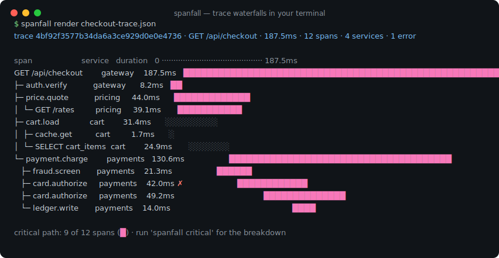
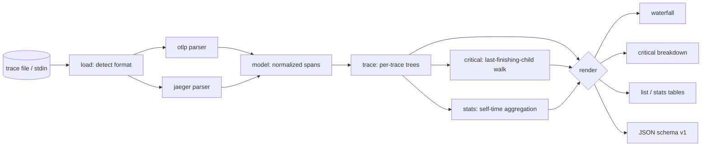

# spanfall

[English](README.md) | [中文](README.zh.md) | [日本語](README.ja.md)

[](LICENSE) [](go.mod) [](CHANGELOG.md)  [](CONTRIBUTING.md)

**spanfall：OTLP・Jaeger のトレースファイルをクリティカルパス強調付きのターミナル・ウォーターフォールとして描画する、オープンソースのゼロ依存 CLI——ファイルを読んでレイテンシを見る、バックエンドは一切不要。**



```bash
git clone https://github.com/JaydenCJ/spanfall && cd spanfall
go build -o spanfall ./cmd/spanfall    # single static binary, stdlib only
```

> プレリリース：v0.1.0 はまだどのパッケージレジストリにも公開していません。上記の手順でソースからビルドしてください（Go ≥1.22 なら可）。

## なぜ spanfall？

トレースはファイルとして共有されます。誰かが OTLP エクスポートや Jaeger の "Download JSON" をインシデントチャンネルに投げ込み、*「このリクエストはなぜ遅い？」*と尋ねる。既存のビューアはどれも稼働中のバックエンドを前提にしています——Jaeger や Grafana Tempo は取り込み・ストレージ・ブラウザが揃うまで span を 1 本も見せてくれず、深夜 3 時にファイル 1 個のためにそれを立てるのは馬鹿げています。`jq` はバックエンド不要ですが、返ってくるのはナノ秒の整数であって絵ではない。spanfall はその中間を埋めます：ファイル（OTLP JSON・collector JSONL・Jaeger エクスポートを自動判別）を読み、クリティカルパスを強調した整列ウォーターフォールを出力し、どの span がレイテンシを握っているかを正確に定量化します。出力はプレーンテキストなので grep も diff もチャンネルへの貼り戻しもでき、CI ゲート（`--fail-on-error` で終了コード 1）にもなる——ブラウザのタブにはどれ一つできないことです。

| | spanfall | Jaeger UI | Grafana Tempo | jq + 目視 |
|---|---|---|---|---|
| ファイル単体で動く、バックエンド不要 | ✅ | ❌ collector+ストレージ必須 | ❌ 取り込み必須 | ✅ |
| クリティカルパス強調 | ✅ | ✅（ブラウザ内のみ） | ❌ | ❌ |
| span ごとの自己時間の内訳 | ✅ | ❌ | ❌ | ❌ |
| grep・貼り付け可能な出力 | ✅ | ❌ | ❌ | 部分的 |
| 終了コード付き CI ゲート | ✅ | ❌ | ❌ | 自作 |
| OTLP *と* Jaeger JSON の両対応 | ✅ | Jaeger ネイティブ | OTLP ネイティブ | 対象外 |
| ランタイム依存 | 0 | JVM 時代の一式 | オブジェクトストレージ | 0 |

<sub>依存数の確認は 2026-07-12 時点：spanfall は Go 標準ライブラリのみを import。最小構成の Jaeger all-in-one でもマルチサービスのコンテナイメージが要り、Tempo はオブジェクトストレージに加え可視化に Grafana が必要。</sub>

## 特徴

- **ターミナルの中のウォーターフォール** — 整列された span ツリー、時間に比例したタイムラインバー、サービス列と所要時間列、エラーマーカー。1 画面でリクエストの物語が読み切れます。
- **クリティカルパス強調** — エンドツーエンドのレイテンシを実際に決めた span をソリッドバー（tty では赤色）で描画。`spanfall critical` が span ごとの自己時間に分解し、その合計は検証可能にトレースの 100% になります。
- **3 形式を自動判別** — OTLP/JSON エクスポート、OpenTelemetry Collector `file` exporter の JSON Lines、Jaeger UI のダウンロードを同じビューに正規化。16 進でも base64 の ID でも、camelCase でも snake_case でも、数値でも列挙名でも受け付けます。
- **パイプラインのための設計** — 7 ビット限定出力の `--ascii`、`--color never|always|auto`、`critical`・`list`・`stats` の安定 JSON（`schema_version: 1`）、CI が分岐できる終了コード。
- **インシデントファイルの汚れに耐性** — 孤児 span・重複 ID・親サイクル・時計ずれの子 span は（追加ルート化・区間クランプで）穏やかに劣化し、クラッシュもデータ欠落も起こしません。
- **ファイル丸ごとトリアージ** — `spanfall list` が複数トレースファイルの全トレースを棚卸しし、`spanfall stats` が全トレース横断で操作ごとの自己時間を集計、時間の本当の行き先を示します。
- **ゼロ依存・完全オフライン** — Go 標準ライブラリのみ。テレメトリなし、ネットワークなし、永遠に。ファイルはあなたのマシンから出ません。

## クイックスタート

```bash
./spanfall render examples/checkout-trace.json
```

実際にキャプチャした出力：

```text
trace 4bf92f3577b34da6a3ce929d0e0e4736 · GET /api/checkout · 187.5ms · 12 spans · 4 services · 1 error

span                     service   duration   0 ··········································· 187.5ms
GET /api/checkout        gateway    187.5ms   ██████████████████████████████████████████████████████
├─ auth.verify           gateway      8.2ms   ██
├─ price.quote           pricing     44.0ms      █████████████
│  └─ GET /rates         pricing     39.1ms       ███████████
├─ cart.load             cart        31.4ms      ░░░░░░░░░
│  ├─ cache.get          cart         1.7ms      ░
│  └─ SELECT cart_items  cart        24.9ms       ░░░░░░░
└─ payment.charge        payments   130.6ms                   ██████████████████████████████████████
   ├─ fraud.screen       payments    21.3ms                   ██████
   ├─ card.authorize     payments    42.0ms ✗                       ████████████
   ├─ card.authorize     payments    49.2ms                                      ██████████████
   └─ ledger.write       payments    14.0ms                                                    ████

critical path: 9 of 12 spans (█) · run 'spanfall critical' for the breakdown
```

*時間はどこへ消えたか*を問う（`spanfall critical`、実出力）：

```text
critical path · trace 4bf92f3577b34da6a3ce929d0e0e4736 · 187.5ms · 9 of 12 spans on path

  self  % of trace  span               service
 4.7ms        2.5%  GET /api/checkout  gateway
 8.2ms        4.4%  auth.verify        gateway
 4.9ms        2.6%  price.quote        pricing
39.1ms       20.9%  GET /rates         pricing
 4.1ms        2.2%  payment.charge     payments
21.3ms       11.4%  fraud.screen       payments
42.0ms       22.4%  card.authorize     payments ✗ card processor timed out
49.2ms       26.2%  card.authorize     payments
14.0ms        7.5%  ledger.write       payments

on-path self time accounts for 100.0% of the 187.5ms trace
```

失敗して再試行されたカード認可がリクエストの 48.6% を占める——ウォーターフォールで目立っていた `cart` 系の span は 1% も占めていません。

## CLI リファレンス

`spanfall [render|critical|list|stats|version] [flags] [file]` — 既定のサブコマンドは `render`。`-` またはファイル省略で stdin を読みます。終了コード：0 正常、1 `--fail-on-error` 発動、2 使い方エラー、3 実行時エラー。

| フラグ | 既定値 | 効果 |
|---|---|---|
| `--width` | `100` | 出力の総幅（桁数、最小 60） |
| `--color` | `auto` | `auto`・`always`・`never` |
| `--ascii` | オフ | レガシーパイプ向けの 7 ビット ASCII バー/記号 |
| `--trace`（render/critical/stats） | — | ID 前方一致でトレースを 1 本選択 |
| `--all`（render） | オフ | ファイル内の全トレースを描画 |
| `--max-depth`（render） | 無制限 | ネスト深さ N 超の span を隠す |
| `--min-duration`（render） | — | 例：`5ms` 未満の span を隠す |
| `--fail-on-error`（render） | オフ | エラー span があれば終了コード 1 |
| `--format`（critical/list/stats） | `text` | `text` または `json` |

## 入力形式

自動判別なのでフラグ不要——詳細と不正データの扱いは [docs/formats.md](docs/formats.md)、パスのアルゴリズムは [docs/critical-path.md](docs/critical-path.md) を参照。

| 形 | 出どころ |
|---|---|
| `{"resourceSpans": …}` | OTLP/JSON エクスポート（SDK・`otel-cli`・collector debug） |
| 1 行 1 オブジェクト | OpenTelemetry Collector `file` exporter（JSONL） |
| `{"data": [ … ]}` | Jaeger UI "Download JSON" / `/api/traces` |
| `[ …, … ]` | 上記の任意の組み合わせを連結した配列 |

## 検証

このリポジトリは CI を同梱しません。上記の主張はすべてローカル実行で検証しています：

```bash
go test ./...            # 89 deterministic tests, offline, < 5 s
bash scripts/smoke.sh    # end-to-end CLI check, prints SMOKE OK
```

## アーキテクチャ



## ロードマップ

- [x] v0.1.0 — OTLP/Jaeger/JSONL の解析、クリティカルパス強調付きウォーターフォール、`critical`/`list`/`stats` サブコマンド、text+JSON 出力、`--fail-on-error` ゲート、89 テスト + smoke スクリプト
- [ ] `spanfall diff a.json b.json` — 同一エンドポイントのデプロイ前後トレースを比較
- [ ] タイムライン上の span イベント（`--events`）と例外詳細
- [ ] Zipkin JSON v2 入力
- [ ] `--focus SPAN` でウォーターフォールを 1 つのサブツリーに拡大
- [ ] collector `file/rotation` 構成向けの OTLP protobuf（バイナリ `.pb`）入力

全リストは [open issues](https://github.com/JaydenCJ/spanfall/issues) を参照。

## コントリビュート

Issue・議論・プルリクエストを歓迎します——ローカルの作業フロー（フォーマット、vet、テスト、`SMOKE OK`）は [CONTRIBUTING.md](CONTRIBUTING.md) へ。入門向けタスクは [good first issue](https://github.com/JaydenCJ/spanfall/issues?q=is%3Aissue+is%3Aopen+label%3A%22good+first+issue%22)、設計の相談は [Discussions](https://github.com/JaydenCJ/spanfall/discussions) で。

## ライセンス

[MIT](LICENSE)
