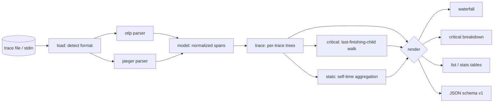

# spanfall

[English](README.md) | [中文](README.zh.md) | [日本語](README.ja.md)

[](LICENSE) [](go.mod) [](CHANGELOG.md)  [](CONTRIBUTING.md)

**spanfall：an open-source, zero-dependency CLI that renders OTLP and Jaeger trace files as terminal waterfalls with critical-path highlighting — read the file, see the latency, no backend required.**


```bash
git clone https://github.com/JaydenCJ/spanfall && cd spanfall
go build -o spanfall ./cmd/spanfall    # single static binary, stdlib only
```

> Pre-release: v0.1.0 is not tagged on a package registry yet; build from source as above (any Go ≥1.22).

## Why spanfall?

Traces get shared as files: someone drags an OTLP export or a Jaeger "Download JSON" into the incident channel and asks *"why was this request slow?"*. The existing viewers all assume a running backend — Jaeger and Grafana Tempo want ingestion, storage, and a browser before they show you a single span, which is absurd overhead for one file at 3 a.m.; `jq` needs no backend but hands you nanosecond integers, not a picture. spanfall is the missing middle: it reads the file (OTLP JSON, collector JSONL, or Jaeger export — auto-detected), prints an aligned waterfall with the critical path highlighted, and quantifies exactly which spans own the latency. Because the output is plain text, it is greppable, diffable, pasteable back into the channel, and usable as a CI gate (`--fail-on-error` exits 1) — none of which a browser tab can do.

| | spanfall | Jaeger UI | Grafana Tempo | jq + eyeballs |
|---|---|---|---|---|
| Works on a plain file, no backend | ✅ | ❌ needs collector+storage | ❌ needs ingestion | ✅ |
| Critical-path highlighting | ✅ | ✅ (in-browser only) | ❌ | ❌ |
| Self-time breakdown per span | ✅ | ❌ | ❌ | ❌ |
| Greppable / pasteable output | ✅ | ❌ | ❌ | partial |
| CI gate with exit codes | ✅ | ❌ | ❌ | DIY |
| Reads OTLP *and* Jaeger JSON | ✅ | Jaeger-native | OTLP-native | n/a |
| Runtime dependencies | 0 | JVM-era stack | object storage | 0 |

<sub>Dependency counts checked 2026-07-12: spanfall imports the Go standard library only; a minimal Jaeger all-in-one deployment ships a multi-service container image, Tempo requires object storage plus Grafana to visualize.</sub>

## Features

- **Waterfall in your terminal** — aligned span tree with proportional timeline bars, service and duration columns, and error markers; one screenful tells the story of the request.
- **Critical-path highlighting** — the spans that actually determined end-to-end latency are drawn solid (and red on a tty); `spanfall critical` breaks them down with per-span self time that provably sums to 100% of the trace.
- **Three formats, auto-detected** — OTLP/JSON exports, OpenTelemetry Collector `file`-exporter JSON Lines, and Jaeger UI downloads all normalize into the same view; hex or base64 IDs, camelCase or snake_case, numbers or enum names.
- **Built for pipelines** — `--ascii` for 7-bit-only output, `--color never|always|auto`, stable JSON (`schema_version: 1`) from `critical`, `list`, and `stats`, and exit codes CI can branch on.
- **Incident-file tolerant** — orphaned spans, duplicate IDs, parent cycles, and clock-skewed children degrade gracefully (extra roots, clamped math) instead of crashing or dropping data.
- **Whole-file triage** — `spanfall list` inventories every trace in a multi-trace file; `spanfall stats` aggregates self time per operation across all of them to show where time actually goes.
- **Zero dependencies, fully offline** — Go standard library only; no telemetry, no network, ever. The file never leaves your machine.

## Quickstart

```bash
./spanfall render examples/checkout-trace.json
```

Real captured output:

```text
trace 4bf92f3577b34da6a3ce929d0e0e4736 · GET /api/checkout · 187.5ms · 12 spans · 4 services · 1 error

span                     service   duration   0 ··········································· 187.5ms
GET /api/checkout        gateway    187.5ms   ██████████████████████████████████████████████████████
├─ auth.verify           gateway      8.2ms   ██
├─ price.quote           pricing     44.0ms      █████████████
│  └─ GET /rates         pricing     39.1ms       ███████████
├─ cart.load             cart        31.4ms      ░░░░░░░░░
│  ├─ cache.get          cart         1.7ms      ░
│  └─ SELECT cart_items  cart        24.9ms       ░░░░░░░
└─ payment.charge        payments   130.6ms                   ██████████████████████████████████████
   ├─ fraud.screen       payments    21.3ms                   ██████
   ├─ card.authorize     payments    42.0ms ✗                       ████████████
   ├─ card.authorize     payments    49.2ms                                      ██████████████
   └─ ledger.write       payments    14.0ms                                                    ████

critical path: 9 of 12 spans (█) · run 'spanfall critical' for the breakdown
```

Ask *where the time went* (`spanfall critical`, real output):

```text
critical path · trace 4bf92f3577b34da6a3ce929d0e0e4736 · 187.5ms · 9 of 12 spans on path

  self  % of trace  span               service
 4.7ms        2.5%  GET /api/checkout  gateway
 8.2ms        4.4%  auth.verify        gateway
 4.9ms        2.6%  price.quote        pricing
39.1ms       20.9%  GET /rates         pricing
 4.1ms        2.2%  payment.charge     payments
21.3ms       11.4%  fraud.screen       payments
42.0ms       22.4%  card.authorize     payments ✗ card processor timed out
49.2ms       26.2%  card.authorize     payments
14.0ms        7.5%  ledger.write       payments

on-path self time accounts for 100.0% of the 187.5ms trace
```

The failed-then-retried card authorization owns 48.6% of the request — the `cart` spans, prominent in the waterfall, own none of it.

## CLI reference

`spanfall [render|critical|list|stats|version] [flags] [file]` — `render` is the default; `-` or no file reads stdin. Exit codes: 0 ok, 1 `--fail-on-error` breach, 2 usage error, 3 runtime error.

| Flag | Default | Effect |
|---|---|---|
| `--width` | `100` | total output width in columns (minimum 60) |
| `--color` | `auto` | `auto`, `always`, or `never` |
| `--ascii` | off | 7-bit ASCII bars/glyphs for legacy pipelines |
| `--trace` (render/critical/stats) | — | select one trace by ID prefix |
| `--all` (render) | off | render every trace in the file |
| `--max-depth` (render) | unlimited | hide spans nested deeper than N |
| `--min-duration` (render) | — | hide spans shorter than e.g. `5ms` |
| `--fail-on-error` (render) | off | exit 1 if the trace contains error spans |
| `--format` (critical/list/stats) | `text` | `text` or `json` |

## Input formats

Auto-detected, no flag needed — details and the malformed-data policy in [docs/formats.md](docs/formats.md), and the path algorithm in [docs/critical-path.md](docs/critical-path.md).

| Shape | Source |
|---|---|
| `{"resourceSpans": …}` | OTLP/JSON export (SDKs, `otel-cli`, collector debug) |
| one object per line | OpenTelemetry Collector `file` exporter (JSONL) |
| `{"data": [ … ]}` | Jaeger UI "Download JSON" / `/api/traces` |
| `[ …, … ]` | concatenated array of any mix of the above |

## Verification

This repository ships no CI; every claim above is verified by local runs:

```bash
go test ./...            # 89 deterministic tests, offline, < 5 s
bash scripts/smoke.sh    # end-to-end CLI check, prints SMOKE OK
```

## Architecture



## Roadmap

- [x] v0.1.0 — OTLP/Jaeger/JSONL parsing, waterfall with critical-path highlighting, `critical`/`list`/`stats` subcommands, text+JSON output, `--fail-on-error` gate, 89 tests + smoke script
- [ ] `spanfall diff a.json b.json` — compare the same endpoint's traces before/after a deploy
- [ ] Span events on the timeline (`--events`) with exception details
- [ ] Zipkin JSON v2 input
- [ ] `--focus SPAN` to zoom the waterfall into one subtree
- [ ] OTLP protobuf (binary `.pb`) input for collector `file/rotation` setups

See the [open issues](https://github.com/JaydenCJ/spanfall/issues) for the full list.

## Contributing

Issues, discussions and pull requests are welcome — see [CONTRIBUTING.md](CONTRIBUTING.md) for the local workflow (format, vet, tests, `SMOKE OK`). Good entry points are labelled [good first issue](https://github.com/JaydenCJ/spanfall/issues?q=is%3Aissue+is%3Aopen+label%3A%22good+first+issue%22), and design questions live in [Discussions](https://github.com/JaydenCJ/spanfall/discussions).

## License

[MIT](LICENSE)
