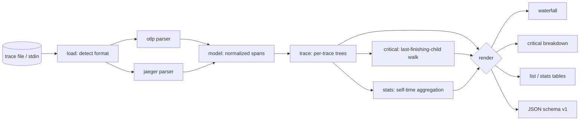

# spanfall

[English](README.md) | [中文](README.zh.md) | [日本語](README.ja.md)

[](LICENSE) [](go.mod) [](CHANGELOG.md)  [](CONTRIBUTING.md)

**spanfall：开源零依赖 CLI，把 OTLP 与 Jaeger trace 文件渲染成带关键路径高亮的终端瀑布图——读文件、看延迟，无需任何后端。**


```bash
git clone https://github.com/JaydenCJ/spanfall && cd spanfall
go build -o spanfall ./cmd/spanfall    # single static binary, stdlib only
```

> 预发布：v0.1.0 尚未发布到任何包仓库；请按上述方式从源码构建（Go ≥1.22 即可）。

## 为什么选 spanfall？

Trace 常常以文件形式流转：有人把一份 OTLP 导出或 Jaeger 的 "Download JSON" 拖进事故频道，然后问*"这个请求为什么慢？"*。现有的查看器全都默认有一套在跑的后端——Jaeger 和 Grafana Tempo 要先有摄入、存储和浏览器才肯给你看一个 span，凌晨三点为一个文件搭这些纯属荒谬；`jq` 不需要后端，但递给你的是纳秒整数，不是一幅图。spanfall 填补了中间地带：读取文件（OTLP JSON、collector JSONL 或 Jaeger 导出——自动识别），打印一张对齐的瀑布图并高亮关键路径，精确量化延迟到底属于哪些 span。由于输出是纯文本，它可以 grep、diff、直接粘回频道，还能当 CI 门禁（`--fail-on-error` 时退出码 1）——这些浏览器标签页一样都做不到。

| | spanfall | Jaeger UI | Grafana Tempo | jq + 肉眼 |
|---|---|---|---|---|
| 直接读文件，无需后端 | ✅ | ❌ 需要 collector+存储 | ❌ 需要摄入 | ✅ |
| 关键路径高亮 | ✅ | ✅（仅限浏览器内） | ❌ | ❌ |
| 每个 span 的自身耗时拆解 | ✅ | ❌ | ❌ | ❌ |
| 可 grep / 可粘贴的输出 | ✅ | ❌ | ❌ | 部分 |
| 带退出码的 CI 门禁 | ✅ | ❌ | ❌ | 自己写 |
| 同时读 OTLP *和* Jaeger JSON | ✅ | Jaeger 原生 | OTLP 原生 | 不适用 |
| 运行时依赖 | 0 | JVM 时代的全家桶 | 对象存储 | 0 |

<sub>依赖数量核对于 2026-07-12：spanfall 只引用 Go 标准库；最小化的 Jaeger all-in-one 部署也要一个多服务容器镜像，Tempo 需要对象存储外加 Grafana 才能可视化。</sub>

## 特性

- **终端里的瀑布图** — 对齐的 span 树、按比例绘制的时间轴条、service 与耗时列、错误标记；一屏就能讲完这个请求的故事。
- **关键路径高亮** — 真正决定端到端延迟的 span 用实心条绘制（tty 上还会标红）；`spanfall critical` 逐个拆解其自身耗时，且可验证地加总为 trace 的 100%。
- **三种格式，自动识别** — OTLP/JSON 导出、OpenTelemetry Collector `file` exporter 的 JSON Lines、Jaeger UI 下载文件都归一到同一视图；十六进制或 base64 ID、camelCase 或 snake_case、数字或枚举名统统接受。
- **为管道而生** — `--ascii` 输出纯 7 位字符，`--color never|always|auto`，`critical`、`list`、`stats` 提供稳定 JSON（`schema_version: 1`），退出码可供 CI 分支判断。
- **容忍事故现场的脏数据** — 孤儿 span、重复 ID、父级环、时钟偏移的子 span 都会优雅降级（变成额外根节点、做区间钳制），绝不崩溃或丢数据。
- **整文件分诊** — `spanfall list` 盘点多 trace 文件里的每一条 trace；`spanfall stats` 跨全部 trace 按操作聚合自身耗时，直指时间真正的去处。
- **零依赖、完全离线** — 只用 Go 标准库；没有遥测、没有网络，永远如此。文件不会离开你的机器。

## 快速上手

```bash
./spanfall render examples/checkout-trace.json
```

真实捕获的输出：

```text
trace 4bf92f3577b34da6a3ce929d0e0e4736 · GET /api/checkout · 187.5ms · 12 spans · 4 services · 1 error

span                     service   duration   0 ··········································· 187.5ms
GET /api/checkout        gateway    187.5ms   ██████████████████████████████████████████████████████
├─ auth.verify           gateway      8.2ms   ██
├─ price.quote           pricing     44.0ms      █████████████
│  └─ GET /rates         pricing     39.1ms       ███████████
├─ cart.load             cart        31.4ms      ░░░░░░░░░
│  ├─ cache.get          cart         1.7ms      ░
│  └─ SELECT cart_items  cart        24.9ms       ░░░░░░░
└─ payment.charge        payments   130.6ms                   ██████████████████████████████████████
   ├─ fraud.screen       payments    21.3ms                   ██████
   ├─ card.authorize     payments    42.0ms ✗                       ████████████
   ├─ card.authorize     payments    49.2ms                                      ██████████████
   └─ ledger.write       payments    14.0ms                                                    ████

critical path: 9 of 12 spans (█) · run 'spanfall critical' for the breakdown
```

追问*时间花在哪了*（`spanfall critical`，真实输出）：

```text
critical path · trace 4bf92f3577b34da6a3ce929d0e0e4736 · 187.5ms · 9 of 12 spans on path

  self  % of trace  span               service
 4.7ms        2.5%  GET /api/checkout  gateway
 8.2ms        4.4%  auth.verify        gateway
 4.9ms        2.6%  price.quote        pricing
39.1ms       20.9%  GET /rates         pricing
 4.1ms        2.2%  payment.charge     payments
21.3ms       11.4%  fraud.screen       payments
42.0ms       22.4%  card.authorize     payments ✗ card processor timed out
49.2ms       26.2%  card.authorize     payments
14.0ms        7.5%  ledger.write       payments

on-path self time accounts for 100.0% of the 187.5ms trace
```

失败后重试的银行卡授权占了请求的 48.6%——在瀑布图里很显眼的 `cart` 系列 span 一点都不占。

## CLI 参考

`spanfall [render|critical|list|stats|version] [flags] [file]` — 默认子命令是 `render`；`-` 或不给文件则读 stdin。退出码：0 正常，1 `--fail-on-error` 触发，2 用法错误，3 运行时错误。

| 标志 | 默认值 | 作用 |
|---|---|---|
| `--width` | `100` | 输出总宽度（列数，最小 60） |
| `--color` | `auto` | `auto`、`always` 或 `never` |
| `--ascii` | 关 | 7 位 ASCII 条形/符号，兼容老式管道 |
| `--trace`（render/critical/stats） | — | 按 ID 前缀选择一条 trace |
| `--all`（render） | 关 | 渲染文件中的每一条 trace |
| `--max-depth`（render） | 不限 | 隐藏嵌套深度超过 N 的 span |
| `--min-duration`（render） | — | 隐藏短于如 `5ms` 的 span |
| `--fail-on-error`（render） | 关 | trace 含错误 span 时退出码 1 |
| `--format`（critical/list/stats） | `text` | `text` 或 `json` |

## 输入格式

自动识别，无需任何标志——细节与脏数据处理策略见 [docs/formats.md](docs/formats.md)，路径算法见 [docs/critical-path.md](docs/critical-path.md)。

| 形态 | 来源 |
|---|---|
| `{"resourceSpans": …}` | OTLP/JSON 导出（SDK、`otel-cli`、collector debug） |
| 每行一个对象 | OpenTelemetry Collector `file` exporter（JSONL） |
| `{"data": [ … ]}` | Jaeger UI "Download JSON" / `/api/traces` |
| `[ …, … ]` | 上述任意混合拼接成的数组 |

## 验证

本仓库不附带 CI；上述每一条主张都由本地运行验证：

```bash
go test ./...            # 89 deterministic tests, offline, < 5 s
bash scripts/smoke.sh    # end-to-end CLI check, prints SMOKE OK
```

## 架构



## 路线图

- [x] v0.1.0 — OTLP/Jaeger/JSONL 解析、带关键路径高亮的瀑布图、`critical`/`list`/`stats` 子命令、text+JSON 输出、`--fail-on-error` 门禁、89 个测试 + smoke 脚本
- [ ] `spanfall diff a.json b.json` — 对比同一端点部署前后的 trace
- [ ] 时间轴上的 span 事件（`--events`）与异常详情
- [ ] Zipkin JSON v2 输入
- [ ] `--focus SPAN` 把瀑布图聚焦到某个子树
- [ ] OTLP protobuf（二进制 `.pb`）输入，支持 collector `file/rotation` 场景

完整列表见 [open issues](https://github.com/JaydenCJ/spanfall/issues)。

## 参与贡献

欢迎提 issue、参与讨论和提交 PR——本地工作流（格式化、vet、测试、`SMOKE OK`）见 [CONTRIBUTING.md](CONTRIBUTING.md)。入门任务标注为 [good first issue](https://github.com/JaydenCJ/spanfall/issues?q=is%3Aissue+is%3Aopen+label%3A%22good+first+issue%22)，设计问题请到 [Discussions](https://github.com/JaydenCJ/spanfall/discussions)。

## 许可证

[MIT](LICENSE)
